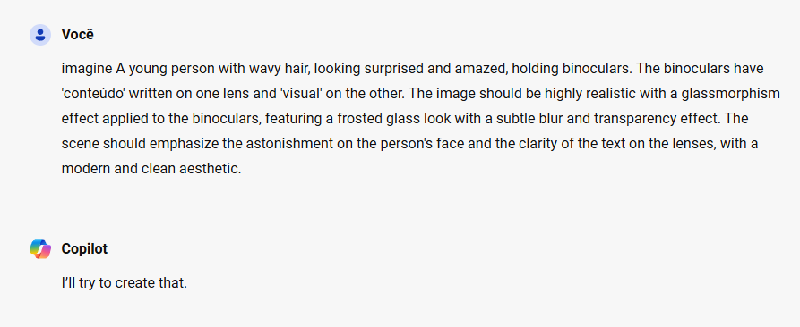
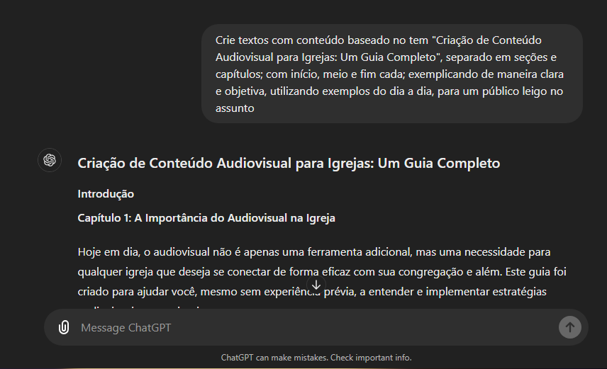
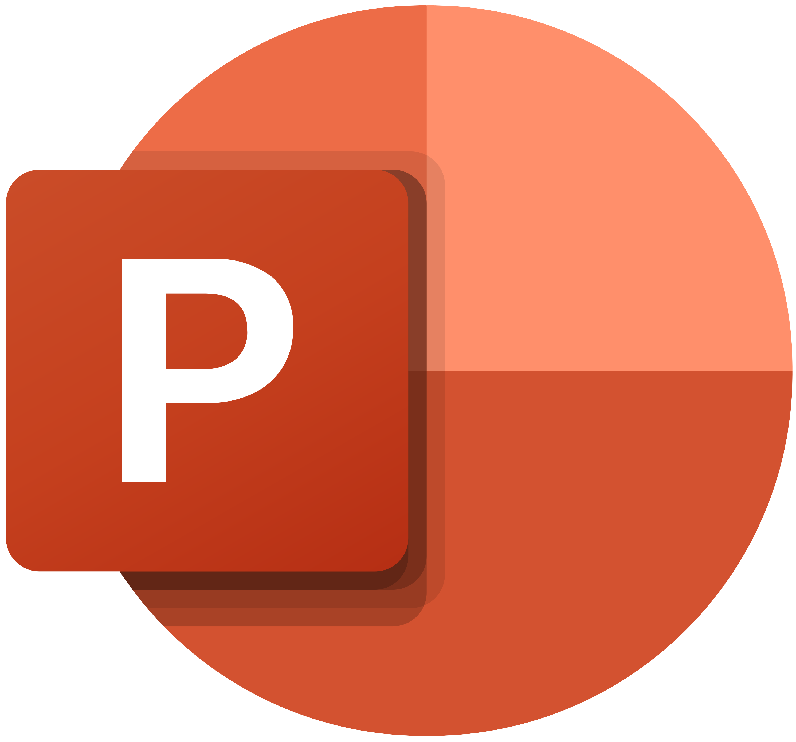

# eBook-feito-com-IA


# Criando Conteúdo Visual - O Guia Inicial Para Engajar e Inspirar Sua Congregação

## Descrição

Este projeto é o resultado de um exercício do curso "Santander 2024 - Fundamentos de IA para Devs", ministrado pelo professor Felipe Aguiar. A proposta era criar um eBook utilizando técnicas de prompts aprendidas durante o curso. Escolhi o tema de criação de conteúdo audiovisual para igrejas, baseado na minha experiência como voluntária na mídia por 2 anos em uma igreja onde congreguei. O eBook foi feito com o objetivo de ser um guia inicial para quem deseja engajar e inspirar sua congregação através de conteúdo visual.

## Etapas de Execução

### 1. Planejamento
- Fiz um board no **Milanote** com checklist e imagens de referência para a parte de design.
- Criei um plano de conteúdo e estrutura para o eBook.

### 1.1 Organização e Brainstorm

<a target="_blank" href="https://app.milanote.com/1SvYeX1YYO3M6S?p=LwqTauaHZz3">
  
</a>

### 2. Geração de Imagens
- Utilizei o **Copilot** para a geração de imagens.
- Pedi ajuda ao ChatGPT para gerar um prompt em inglês bem detalhado do que eu queria para as imagens.
```
Me ajude a criar um prompt para fazer uma imagem no midJourney onde tem um jovem de cabelos ondulados olhando para frente com um binóculo escrito nas lentes (uma  escrito "conteúdo" e outro "visual" ) com expressão no rosto de ver algo surpreendente, no estilo realista com glassmorphism aplicado nos binóculos
```




### 3. Design da Capa
- Editei a capa no Photoshop, utilizando também o recurso de IA do **Adobe Firefly** para aprimorar a resolução de altura e largura do design.


### 4. Construção do eBook 🛠 
- Utilizei o **PowerPoint** para montar o PDF do eBook, organizando o conteúdo e ajustando o layout.

# 🤖 Prompts e  <a target="_blank" href="https://chatgpt.com/share/347e4e80-9394-45b2-8f64-40aa4992a2b3">Conversa completa com o chatGPT</a> 



### Alguns dos **principais** prompts utilizados:
```
me dê sugestões de temas para um ebook que seja relevante na área da igreja e audiovisual 
```
```
Crie textos com conteúdo baseado no tem "Criação de Conteúdo Audiovisual para Igrejas: Um Guia Completo", separado em seções e capítulos; com início, meio e fim cada; exemplicando de maneira clara e objetiva, utilizando exemplos do dia a dia, para um público leigo no assunto
```
```
faça um sumário com os capítulos e seções
```
```
Dê dicas de como pode ser a capa desse eBook atraindo a atenção de um público mais jovem
```
```
Crie um título que chame atenção sobre o conteúdo que fizemos nesta conversa que seja consiso e descritivo como também um subtítulo, gere 5 opções

{REGRAS}
> Evite palavra como fé
> O título deve ter no máximo 4 palavras
> Utilize técnicas de copywrite
```
## 🤔 Como Utilizar Este Repositório

1. Clone o repositório para sua máquina local:
  ```bash
    git clone https://github.com/AmandaMeneghini/eBook-feito-com-IA.git
  ```
  
2. Navegue até a pasta do projeto:
  ```bash
  cd eBook-feito-com-IA
  ```
3. Abra o arquivo 
"eBook - Criando Conteúdo Visual - O Guia Inicial Para Engajar e Inspirar Sua Congregação.pdf" para visualizar o eBook completo.

## 🗂 Estrutura do Projeto
```
/
├── assets/
│   └── images/           # Imagens utilizadas
|         └── icons/      # logos utilizados
├── docs/
│   └── eBook - Criando Conteúdo Visual - O Guia Inicial Para 
|               Engajar e Inspirar Sua Congregação.pdf         # PDF do eBook final
│   
└── README.md             # Este arquivo
    
```

## ⚙ Construído com 

<a href="https://milanote.com/"></a>
<a href="https://copilot.microsoft.com/"></a>
<a href="https://chatgpt.com/"></a>
<a href="https://www.adobe.com/br/products/photoshop.html"></a>
<a href="https://www.adobe.com/br/products/firefly.html"></a>
<a href="https://www.microsoft.com/pt-br/microsoft-365/powerpoint"></a>


## 👨‍💻 Autora

<p>
    
    <p>&nbsp&nbsp&nbspAmanda Meneghini<br>
    &nbsp&nbsp&nbsp
    <a href="https://github.com/AmandaMeneghini">GitHub</a>&nbsp;|&nbsp;
    <a href="https://www.linkedin.com/in/amanda-meneghini/">LinkedIn</a>
    &nbsp;&nbsp;
    </p>
<br/>

---

 Feito com 🤍 por [Amanda Meneghini](https://github.com/AmandaMeneghini)
